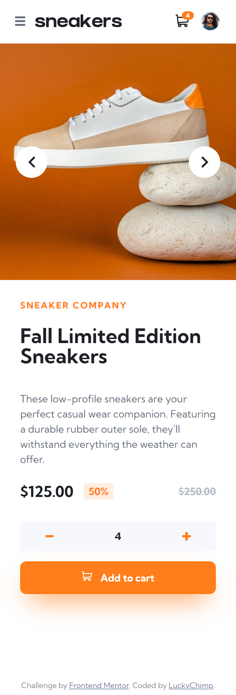

# Frontend Mentor - E-commerce product page solution

This is a solution to the [E-commerce product page challenge on Frontend Mentor](https://www.frontendmentor.io/challenges/ecommerce-product-page-UPsZ9MJp6). Frontend Mentor challenges help you improve your coding skills by building realistic projects.

## Table of contents

- [Overview](#overview)
  - [The challenge](#the-challenge)
  - [Screenshots](#screenshots)
  - [Link](#link)
- [My process](#my-process)
  - [Built with](#built-with)
  - [What I learned](#what-i-learned)
  - [Useful resources](#useful-resources)
- [Author](#author)

## Overview

### The challenge

Users should be able to:

- View the optimal layout for the site depending on their device's screen size
- See hover states for all interactive elements on the page
- Open a lightbox gallery by clicking on the large product image
- Switch the large product image by clicking on the small thumbnail images
- Add items to the cart
- View the cart and remove items from it

### Screenshots

#### Desktop

 

#### Desktop with hovering the avatar

 

#### Desktop with opened lightbox

 

#### Desktop with cart popup

 

#### Desktop with filled cart popup

 

#### Tablet with filled cart popup

 

#### Mobile

</img>
 

#### Mobile with opened sidebar

 

#### Mobile with cart popup

 

#### Mobile with filled cart popup

 

### Link

- Solution URL: [https://react-product-page-nine.vercel.app/](https://react-product-page-nine.vercel.app/)

## My process

### Built with

- Semantic HTML5 markup
- SCSS for clean, easy and less CSS
- Flexbox
- [React](https://reactjs.org/) - JS library
- [Hammer.js](https://hammerjs.github.io/) for touch gestures for product image preview movement on touch devices

### What I learned

I have learned to import SVG files as [ReactComponents](https://blog.logrocket.com/how-to-use-svgs-react/) to make them easier to use in the project. I also found out how to use reacts [useCallback](https://beta.reactjs.org/reference/react/useCallback) function to avoid too many unnecessary rerenders and optimize rendering performance.

### Useful resources

- [Hammer.js](https://hammerjs.github.io/) - It's the first time I worked with this library. Hammer.js ist very very simple and intuitive to work with.

## Author

- Frontend Mentor - [@LuckyChimp](https://www.frontendmentor.io/profile/LuckyChimp)
